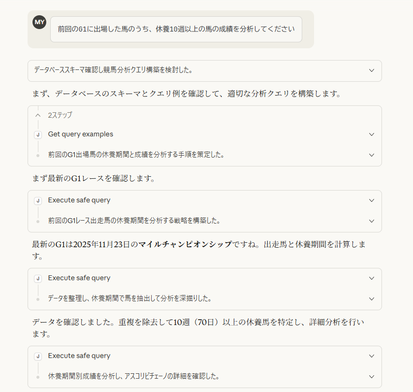
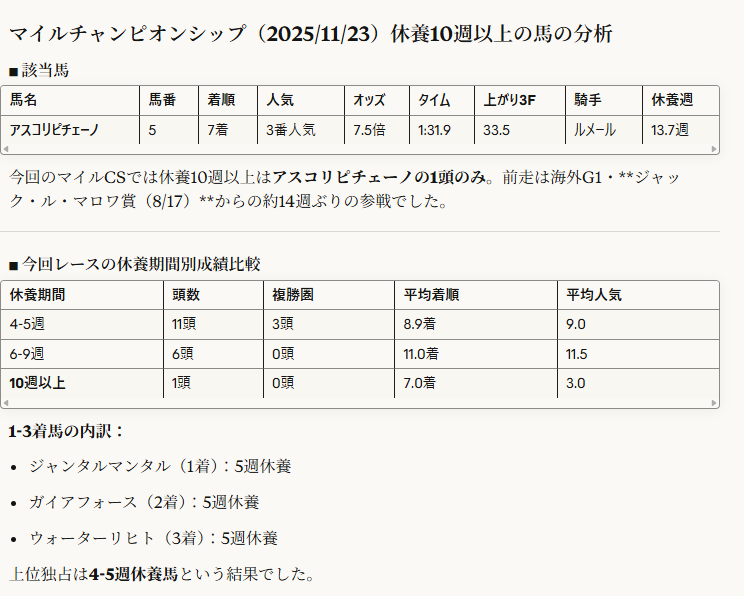

# JVLink MCP Server

**Claudeに話しかけるだけで、競馬データを自由に分析できます。**

SQLを書く必要はありません。自然な日本語で質問すれば、過去のレース結果、騎手成績、血統傾向など、あらゆる競馬データを調べられます。





## こんな質問ができます

### 「1番人気の勝率はどのくらい？」

| 出走数 | 勝利数 | 勝率 |
|--------|--------|------|
| 6,294 | 2,474 | 39.3% |

### 「今年勝ち星が多い騎手は？」

| 騎手 | 騎乗数 | 勝利 | 勝率 |
|------|--------|------|------|
| ルメール | 537 | 142 | 26.4% |
| 戸崎圭太 | 832 | 135 | 16.2% |
| 松山弘平 | 863 | 125 | 14.5% |
| 坂井瑠星 | 729 | 119 | 16.3% |
| 川田将雅 | 542 | 118 | 21.8% |

### 「産駒の勝ち星が多い種牡馬は？」

| 種牡馬 | 出走数 | 勝利 |
|--------|--------|------|
| キズナ | 1,717 | 207 |
| ロードカナロア | 1,633 | 178 |
| ドレフォン | 1,382 | 150 |
| エピファネイア | 1,488 | 138 |
| リアルスティール | 1,106 | 125 |

### 他にもこんな質問ができます

- 東京芝1600mで内枠と外枠、どっちが有利？
- G1レースで1番人気が飛んだレースを教えて
- ディープインパクト産駒の芝での成績は？
- 馬体重500kg以上の馬の成績は？
- 上がり3F最速で勝った馬を調べて

## インストール

### 1. 必要なもの

- **Python 3.11以上**
- **uv** (Pythonパッケージマネージャー)
- **競馬データベース** - [jrvltsql](https://github.com/miyamamoto/jrvltsql) で作成

### 2. このリポジトリをクローン

```bash
git clone https://github.com/miyamamoto/jvlink-mcp-server.git
cd jvlink-mcp-server
```

### 3. 依存関係をインストール

```bash
uv sync
```

これでインストールは完了です。

## Claude Desktop / Claude Code への接続

### Claude Desktopで使う

`claude_desktop_config.json` に追加:

```json
{
  "mcpServers": {
    "jvlink": {
      "command": "uv",
      "args": [
        "run",
        "--directory",
        "C:\Users\yourname\jvlink-mcp-server",
        "python",
        "-m",
        "jvlink_mcp_server.server"
      ],
      "env": {
        "DB_TYPE": "sqlite",
        "DB_PATH": "C:/Users/yourname/jrvltsql/data/keiba.db"
      }
    }
  }
}
```

パスは環境に合わせて変更してください。Claude Desktopを再起動すれば使えます。

### Claude Codeで使う

```bash
claude mcp add jvlink \
  -e DB_TYPE=sqlite \
  -e DB_PATH=/path/to/keiba.db \
  -- uv run --directory /path/to/jvlink-mcp-server python -m jvlink_mcp_server.server
```

## 使い方のコツ

### 1. まずは気軽に質問
思いついたことをそのまま聞いてみてください。Claudeが適切なデータを探して回答します。

### 2. 具体的な条件を追加
「東京の」「芝の」「1600mの」「G1の」など、条件を追加するとより詳細な分析ができます。

### 3. 比較を依頼
「AとBを比較して」「年度別に推移を見せて」など、比較分析も得意です。

### 4. 深掘りする
回答を見て気になったことがあれば、続けて質問してください。会話の流れで分析を深められます。

## もっと詳しく

### 質問例をもっと見たい
→ [サンプル質問集](docs/SAMPLE_QUESTIONS.md)

初級から上級まで、200以上の質問例があります。

### 技術的な詳細を知りたい
→ [データベース構成](docs/DATABASE_SETUP.md) / [クエリガイドライン](QUERY_GUIDELINES.md)

開発者向けの技術情報です。

## ライセンス

Apache License 2.0
